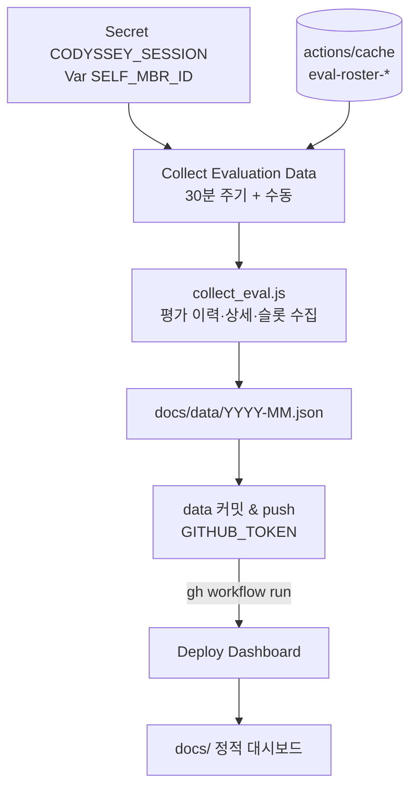

# 📊 Codyssey 동료평가 트래커 (Peer Evaluation Tracker)

codyssey.kr의 동료평가 활동(평가/취소/슬롯 패턴)을 GitHub Actions가 주기적으로 수집해
월별 JSON으로 저장하고, GitHub Pages 정적 대시보드로 시각화합니다.

> ⚠️ **민감정보 주의**: 실명 기반으로 "누가 누구를 평가/기피하는지" 분석을 포함합니다.
> 출입 시간 집계와 달리 대인관계 민감 정보이므로 **공개 Pages 배포는 권장하지 않습니다.**
> 저장소를 Private으로 두고 로컬/사내 배포로 사용하세요.
> (GitHub Pages는 Private 저장소도 기본적으로 공개 URL이 됩니다. 정책 참고: Pro 계정의 접근 제어 사용)
>
> 평가 조회 API는 공식 공개 API가 아닌 **사이트 내부 호출 재사용**입니다.
> 약관/운영정책을 확인하고 본인 계정 세션 범위에서만 사용하세요.

---

## 목차

1. [목표](#목표)
2. [기획](#기획)
3. [구현](#구현)
4. [사용법](#사용법)
5. [Fork해서 사용하는 방법](#fork해서-사용하는-방법)
6. [개발 및 테스트](#개발-및-테스트)

---

## 목표

- 동료평가 **평가/피평가 횟수와 취소(거절·요청취소) 패턴**을 월 단위로 수집·비교한다.
- **언제 평가가 몰리는지**(시간대×요일), **슬롯을 누가 언제 여는지** 패턴을 본다.
- 취소 주체(평가자 거절 vs 피평가자 요청취소)를 구분해 **기피 페어 분석**을 제공한다.
- 수집 결과를 **월별 JSON(`docs/data/YYYY-MM.json`)으로 누적**해 과거 조회가 가능하게 한다.

## 기획

### 수집 범위와 해석 규칙

- 대상 길드: 기본 `3,4,5,6` (`--guilds`로 변경 가능). 명부는 mbrId·이름·레벨·길드 정도만 필요하다.
- 평가 상태(`fixedCd`) 해석: `00006`=완료, `00005`=취소(평가요청취소 → **피평가자** 주도), `00004`=취소(평가거절 → **평가자** 주도).
- 취소의 "주체"가 구분되므로 거절 기피와 요청취소 기피를 따로 본다.
- 세션 소유자 식별: `SELF_MBR_ID` (selfOnly 귀속 모드에 사용).

### 갱신 주기 설계

- 평가 이벤트는 **30분 주기 수집**.
- 로스터(길드 명부)는 준정적 데이터라 **8시간(28,800초) 신선하면 길드 API 생략**. 캐시 파일 옆에 `.fetched` 스탬프를 두고 수집 스크립트가 스스로 신선도를 판정한다.
- GitHub 스케줄러 지연에 대비해 30분 슬롯당 **4개의 크론 스트림**을 둔다(실측 평균 배달 82~110분 관측).

### 데이터 공개 정책

- 수집 데이터는 `docs/data/`에 **그대로 커밋되는 것이 원칙**(이력 = git 이력).
- 다만 실명/관계 데이터이므로 **저장소 공개 여부에 책임**이 따른다. MOCK 모드는 "데이터 파일이 아예 없을 때"만 동작하고, 실데이터를 한 번이라도 본 뒤에는 빈 달도 빈 달로 표시한다(가짜 데이터와 섞이지 않게).

## 구현

### 동작 구조



- **Collect Evaluation Data**(`.github/workflows/collect.yml`): Secret 확인 → 로스터 캐시 복원 → `collect_eval.js` 실행(`--roster-cache` + 신선하면 `--roster-file`) → 변경 있으면 `docs/data/` 커밋·push → 데이터가 바뀐 경우에만 `pages.yml` 디스패치(GITHUB_TOKEN push는 다른 워크플로를 트리거하지 못하는 GitHub 재귀 방지 규칙 대응).
- **Deploy Dashboard**(`.github/workflows/pages.yml`): `docs/**` 변경 push 또는 수동/디스패치 시 `docs/`를 그대로 Pages에 배포한다.
- GITHUB_TOKEN push → pages.yml 재귀 방지 우회를 위해 **데이터 변경 시에만 명시적 디스패치**한다.

### 디렉터리

```
├── .github/workflows/
│   ├── collect.yml        # 30분 수집 + 데이터 커밋 + pages 디스패치
│   └── pages.yml          # docs/ → GitHub Pages
├── collect_eval.js        # 수집기 (Node 20, 외부 의존 없음)
├── docs/                  # ★ 대시보드 (Pages에 통째로 배포)
│   ├── index.html / styles.css / app.js   # 바닐라 JS 대시보드 + MOCK 모드
│   ├── data/              # 월별 수집 JSON (YYYY-MM.json)
│   └── API_DISCOVERY.md   # API 조사 메모
└── .devcontainer/         # Codespace 환경 (GH_PAT_SYNC 선택 선언)
```

### collect_eval.js 주요 옵션

| 옵션 | 설명 |
|---|---|
| `--year Y --month M` | 수집 대상 월 (기본: 현재) |
| `--days N` | 최근 N일만 수집 (기본: 해당 월 전체) |
| `--members id1,id2` | 명부 없이 멤버 직접 지정 |
| `--guilds 3,4,5,6` | 대상 길드 변경 |
| `--roster-file F` | 명부 JSON 파일로 대체 (네트워크 명부 조회 생략, 캐시 오염 방지) |
| `--roster-cache F` | 네트워크 명부 조회분을 캐시 파일에 저장 + `.fetched` 스탬프 |
| `--season/--week/--inst` | 길드 시즌/주차/기관 코드 |
| `--dry-run` | API 호출 없이 경로/필터만 검증 |
| `--out DIR --delay MS` | 출력 디렉터리, 호출 간격 |

## 사용법

### 대시보드 보기

- Pages 주소 접속 → 월 선택 → 캘린더/랭킹/히트맵/슬롯 패널/기피 분석
- 날짜 클릭 → 그날의 평가/취소 목록, 이벤트 클릭 → 평가 상세(점수/코멘트, 수집된 경우)
- 데이터가 하나도 없으면 MOCK 모드 안내 배너와 함께 가상 데이터가 표시된다

### 로컬 수집

```bash
CODYSSEY_SESSION=<JSESSIONID> node collect_eval.js                 # 이번 달 전체
CODYSSEY_SESSION=<JSESSIONID> node collect_eval.js --days 3        # 최근 3일
CODYSSEY_SESSION=<JSESSIONID> node collect_eval.js --dry-run       # 호출 없이 검증
```

결과는 `docs/data/YYYY-MM.json`에 저장됩니다.

### Actions 수동 실행

**Actions → Collect Evaluation Data → Run workflow** — 입력 `year/month/days`로 특정 월·기간만 수집할 수 있습니다.

## Fork해서 사용하는 방법

원본의 Secret, 캐시, 데이터, Actions 이력은 Fork에 복사되지 않습니다. 아래를 **Fork한 본인 저장소에서** 설정하세요.

### 1. Fork + Actions 활성화

1. 원본 저장소에서 **Fork**
2. Fork 저장소 **Actions 탭 → "I understand my workflows..."** 클릭

### 2. Workflow 권한 허용

데이터 커밋·push와 pages 디스패치에 쓰기 권한이 필요합니다.

```
Settings → Actions → General → Workflow permissions
→ Read and write permissions 선택 → Save
```

(워크플로 파일에도 `contents: write`, `actions: write`가 명시되어 있지만, 저장소의 이 설정이 상한입니다.)

### 3. Secret / Variable 등록

```
Settings → Secrets and variables → Actions

[Secrets 탭] New repository secret
  Name:  CODYSSEY_SESSION
  Value: <브라우저에서 복사한 JSESSIONID 값>

[Variables 탭] New repository variable
  Name:  SELF_MBR_ID
  Value: <본인 Codyssey mbrId>   (selfOnly 귀속 분석에 사용, 선택 사항)
```

JSESSIONID 캡처 방법:

1. `https://usr.codyssey.kr` 로그인
2. 개발자 도구(F12) → **Application → Cookies → https://usr.codyssey.kr**
3. `JSESSIONID` 행의 **Value** 복사

> Secret 미등록 시 수집 workflow는 "로그인 전까지 수집을 건너뜁니다." 안내와 함께 조용히 스킵합니다(실패 아님). 세션 만료 시 새 값으로 갱신하세요.

### 4. Pages 소스 지정

```
Settings → Pages → Build and deployment → Source: GitHub Actions
```

배포 후 주소: `https://<내-GitHub-ID>.github.io/<Fork-저장소명>/`

### 5. 최초 실행

**Actions → Collect Evaluation Data → Run workflow** → 성공 시 `docs/data/`에 커밋이 생기고 Deploy Dashboard가 이어집니다.

### Fork 운영 주의

- **실명 데이터**가 git 이력과 Pages에 올라갑니다. 저장소를 Private으로 운영하고, Pages 공개 URL이 외부에 노출되지 않도록 주의하세요.
- GitHub 스케줄 지연은 플랫폼 특성입니다(4중 크론으로 완화 중).

## 개발 및 테스트

```bash
node --check collect_eval.js          # 문법 검사
node collect_eval.js --dry-run        # 네트워크 없이 필터/경로 검증
```

- 대시보드 프런트는 `docs/`(바닐라 JS)라 로컬에서 `python3 -m http.server` 등으로 바로 열 수 있습니다(MOCK 모드 확인 가능).
- 수집기는 외부 npm 의존이 없습니다(Node 20+).
